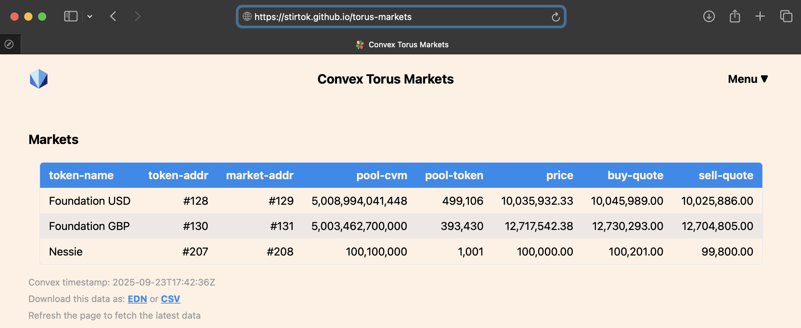

= Torus Markets

A simple app to display the Torus markets data from the Convex distributed ledger.
Its purpose is to be a learning example and a starting point for future app development.
You can run this app by clicking &gt;https://stirtok.github.io/torus-markets[here]&lt;.

 